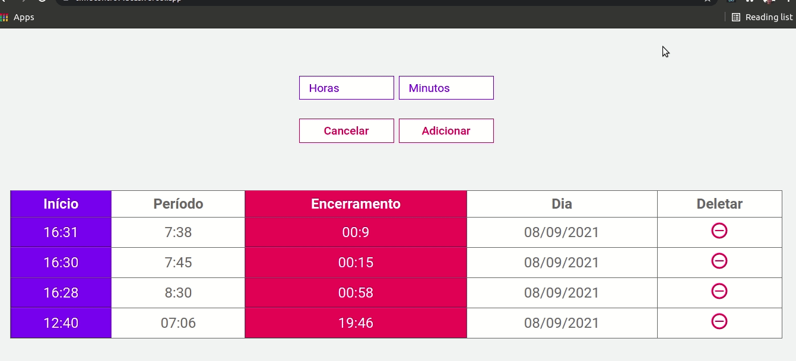

<p align="center">
  <h3 align="center">Time Control app with Next.js</h3>

  <p align="center">
    A simple app for time management when working.
    <br />
    <a href="https://github.com/lucfersan/timecontrol"><strong>Explore the docs »</strong></a>
    <br />
    <br />
    ·
    <a href="https://github.com/lucfersan/timecontrol/issues">Report Bug</a>
    ·
    <a href="https://github.com/lucfersan/timecontrol/issues">Request Feature</a>
  </p>
</p>

## 📚 About The Project



This is an app to manage the period of time you have to work per day.
You can use it by inserting the time you started working and the period you'll work for the day, and the app will give you automatically the time for you to stop.

### 🧰 Built With

- [Next.js](https://nextjs.org/)
- [Styled Components](https://styled-components.com/)
- [Typescript](https://www.typescriptlang.org/)

### 🚀 Installation

1. Clone the repo
   ```sh
   git clone https://github.com/lucfersan/timecontrol.git
   ```
2. Install the packages
   ```sh
   cd todo-list-react
   yarn
   ```

## 🤝 Contributing

Contributions are what make the open source community such an amazing place to be learn, inspire, and create. Any contributions you make are **greatly appreciated**.

1. Fork the Project
2. Create your Feature Branch (`git checkout -b feature/AmazingFeature`)
3. Commit your Changes (`git commit -m 'Add some AmazingFeature'`)
4. Push to the Branch (`git push origin feature/AmazingFeature`)
5. Open a Pull Request

## 🗞️ License

Distributed under the MIT License. See `LICENSE` for more information.

## 📧 Contact

Lucas Fernandes - fernandes.lucas11@outlook.com

Project Link - live view: [https://timecontrol-lucas.vercel.app/](https://timecontrol-lucas.vercel.app/)
